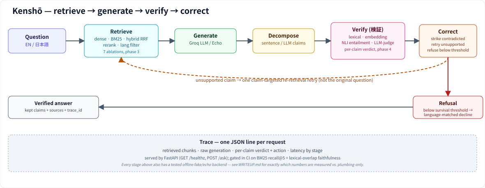

# Kenshō (検証) — project write-up

The README is the technical reference: every module, every design decision,
every command. This is the shorter version — what the project is, why it's
built this way, and what the numbers actually show — for a reader deciding
whether to spend more time on it.

## The problem

Most RAG demos stop at "retrieve some chunks, ask an LLM to answer using
them." That pipeline hallucinates in a specific, dangerous way: the answer
*looks* grounded — it cites sources, it reads confidently — while quietly
saying something the sources don't support. For an enterprise support
assistant, that failure mode is worse than an assistant that says "I don't
know," because a wrong answer that looks right doesn't get double-checked.

Kenshō (検証, "verification") adds the stage most RAG projects skip: after
generation, decompose the answer into individual claims, check each claim
against the specific passages it was retrieved from — not the question, not
the model's general knowledge — and act on the result. A claim that
contradicts its source is struck. A claim nothing supports gets one targeted
re-retrieval attempt. If too little of the answer survives, the whole answer
is replaced with an explicit refusal instead of being shown as a quietly
edited-down version of itself.

## Why bilingual Japanese–English

This project targets a Japanese enterprise-software company, so a
Japanese-capable assistant is the obvious ask. But the language pair is also
a deliberate stress test, not just a market-fit choice:

- Japanese has no word boundaries, so whitespace-tokenized lexical search
  (the naive approach) is close to useless — morphological segmentation is
  mandatory, not an optimization.
- No shared script or cognate vocabulary with English, so cross-lingual
  retrieval has to work through embedding semantics, not accidental lexical
  overlap.
- Distant morphology and syntax make alignment genuinely hard.

An English–Spanish version of this project could look competent on shared
vocabulary alone. This pair can't fake it — which is what makes the retrieval
ablations (below) a real comparison instead of a foregone one.

## Architecture, in one pass



```
question --> retrieve (dense / BM25 / hybrid RRF) --> generate (Groq LLM)
         --> decompose into claims --> verify each claim against its sources
         --> correct (strike / retarget-retrieve / refuse) --> traced response
```

Every stage with a real, model- or network-dependent backend also has a
tested offline stand-in (`Fake`/`Echo`), selected through a `get_X(name,
allow_fallback=bool)` factory that raises by default and only substitutes
with an explicit warning when asked to. That single pattern, applied
consistently from the embedder through the LLM to the verifier, is what let
this project be built and genuinely tested in a network-restricted sandbox
without ever quietly reporting a fake number as a real one — see "What's
real and what isn't," below, for exactly where that line falls.

## Key decisions and trade-offs

**Evaluation before optimization.** The hand-labelled gold sets (retrieval,
faithfulness) were built in phase 2, before any retrieval improvement in
phase 3. Every later change is measured against a fixed baseline instead of
assumed to help — the difference between an engineering result and a
plausible-sounding claim.

**Page-level ground truth, not chunk-level.** The retrieval gold set records
the correct source *page*, not chunk id, so the same 52 items score both the
`structural` and `fixed` chunking strategies without going stale when the
chunking ablation changes what a "chunk" even is.

**`docs/reference/` excluded by default.** It's 928 of 1,370 English pages,
almost all auto-generated API stubs, only 12 translated. Leaving it in would
have made Japanese retrieval look artificially bad for a reason that has
nothing to do with the retriever — a measurement artefact dressed up as a
finding. Caught by actually reading the corpus stats, not assumed.

**Contradicted claims never get a retry.** Only unsupported claims do. A
claim the evidence actively disagrees with isn't fixed by finding more
evidence — re-retrieving just risks a weaker verifier arm misreading some
other passage as support. This is a narrow, deliberate policy, not the
richer alternative (e.g., rewriting the claim) — see Limitations.

**Refusal is a hard replacement, not a soft edit.** Below the survival
threshold, the entire answer is swapped for an explicit, language-matched
refusal. A confidently-worded answer with its weakest sentences quietly
deleted is arguably a worse failure mode than an answer that admits it
doesn't know — it still *reads* fully supported.

**The eval-gated CI check is deliberately narrow.** It only gates on the two
metrics computable with no network access at all (BM25 recall, lexical
faithfulness accuracy) rather than mocking the embedding/NLI/LLM-judge arms
to produce a green check that means nothing. A narrow real gate beats a
broad fake one.

## What's real and what isn't

Two components in this stack need no external network access at all, and
both were measured for real, on the full corpus, in the same sandbox this
project was built in:

| component | needs | measured |
|---|---|---|
| BM25 sparse retrieval (SudachiPy segmentation) | nothing — dictionary ships in the wheel | recall@1 = 0.65, recall@5 = 0.90 (ablation gold set, top-5); recall@5 = 0.896 (CI gate, top-10 rescoring) |
| Lexical-overlap faithfulness verification | nothing | 0.646 accuracy; 0.938 recall on unsupported claims; **0.0 recall on contradicted claims** |

That last number is not a bug — it's the predicted structural limit of the
method, confirmed empirically: token-overlap scoring has no mechanism to
ever detect negation, so it cannot score "contradicted" no matter how
obvious the contradiction is to a human. That gap is exactly what the NLI
arm exists to close.

Everything else in the project — dense embedding retrieval, the
cross-encoder reranker, cross-lingual retrieval, NLI-based contradiction
detection, LLM-judge verification, and real (non-Echo) generation — needs
either Hugging Face Hub access or a Groq API key, neither of which this
build sandbox has. Every one of those components is fully implemented,
unit-tested against deterministic fake backends, and wired end-to-end
(confirmed with a real HTTP smoke test of the running FastAPI service using
fake/echo components) — but the *numbers* those components would produce
have not been measured here, and are reported as such throughout the README
rather than filled in with placeholders. Running `pip install -e
".[retrieval,generation,verify]"` with `HF_HUB_OFFLINE` unset and a Groq key
set, then re-running `scripts/ablate.py`, `scripts/compare_verifiers.py`,
and `scripts/eval_refusal.py`, is what turns those into real results — the
project is built so that run requires no code changes, only environment
access.

## Scale

- 8,446 structural chunks / 5,413 fixed chunks over 406 English + 324
  Japanese pages (305 with a direct parallel counterpart).
- 216 tests, ruff-clean, all passing offline.
- Two hand-labelled gold sets built from primary sources: 52 retrieval items
  (26 EN / 26 JA, 48 answerable + 4 deliberately not) and 48 faithfulness
  items (36 EN / 12 JA) — every query, reference answer, and claim written
  by reading the actual page text, not recalled from general knowledge.
- Seven retrieval ablations and a four-arm claim-verification comparison,
  each scored against the same fixed gold sets rather than seven separate
  one-off benchmarks.

## Limitations (stated up front, not discovered by a reader)

- **BM25 cannot cross the language boundary.** It matches literal tokens, so
  a Japanese query cannot retrieve an English-only passage or vice versa —
  dense embedding search is the only retriever here that can, which is
  exactly what the cross-lingual ablation (3.7) is designed to measure once
  embedding access is available.
- **Correction policy has no claim-rewrite path.** An unsupported claim gets
  struck or recovered by retrieval — never rewritten to match what the
  evidence actually says. Rewriting risks introducing a second, subtler
  hallucination in the act of "fixing" the first one, so it was left out
  rather than added speculatively.
- **The refusal-quality numbers are a mechanism demonstration, not a
  measurement.** With the Echo LLM (the only generator available in this
  sandbox), every one of the 52 gold items gets refused, because Echo's
  placeholder text is uniformly unsupported by every source. That's the
  correct behavior for what it's being fed — it says nothing about the false
  refusal rate or miss rate a real generator would produce.
- **CI gates two metrics, not the whole pipeline.** Extending it to the
  embedding/NLI/LLM-judge arms needs a cached model and a Groq key as CI
  secrets — planned, not pretended to already be solved.
- **Single-corpus evaluation.** Both gold sets are built from one corpus
  (Kubernetes docs). Generalization to a different enterprise-support corpus
  is a claim this project doesn't make and hasn't tested.

## What's next

The roadmap's remaining item, beyond this write-up, is running the full
stack with real model and API access — turning the "wired but unmeasured"
components above into the same kind of honestly-reported real numbers the
BM25 and lexical-overlap rows already have. The architecture doesn't change
for that run; only the environment does.
